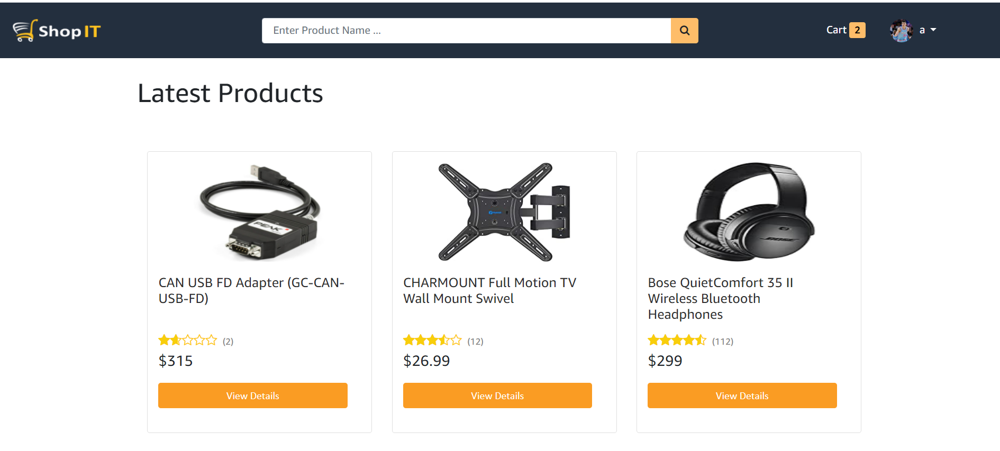

# Getting Started with Create React App
# Click Capture.png website look like
# E commerce web sit  Using some Technologies
 ReactJs
NodeJs
MongoDB
JavaScript
PostMan 
Available Scripts

# Clone
                  1)  clone  https://github.com/Rahul-Kumar24/ShopitBarh.git
                  2)  cd backend 
                                        npm install  # all dependencies are
                    used the command npm run dev // development mod
                   3) cd frontend 
                              npm install # all dependencies are

In the project directory, you can run:

### `npm start`

Runs the app in the development mode.\
Open [http://localhost:3000](http://localhost:3000) to view it in the browser.

